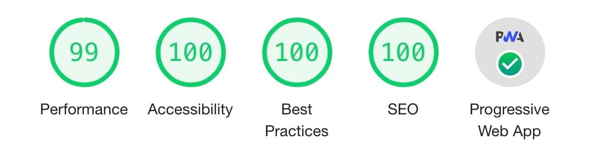
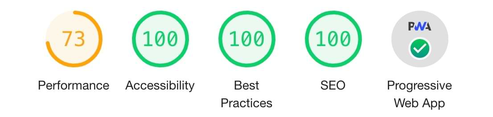

# Nuxt i18n Portfolio Template

 

## A multi-language🌎 portfolio template for Developers.

<br>

### Lighthouse Score:

<p align="center"><b>Desktop</b></p>

<p align="center">

</p>

<br>

<p align="center"><b>Mobile</b></p>

<p align="center">

</p>

<br>

### Desktop View:


---

<br>

### Mobile View:


---

# Features

✅ **Mobile-first UI Design** 📱

✅ **Fully Responsive** 🖥

✅ **Full Static Generation** 🚀

✅ **Styled with Tailwindcss 2.0** 🎨

✅ **Dark Mode (Auto & Manual)** 🌚

<br>

[](https://i18n-nuxt-portfolio-template.web.app/)

<br>

[](https://i18n-nuxt-portfolio-template.web.app/)

# Usage

```bash
# Download this repository to local machine
$ git clone https://github.com/kenxdrgn/nuxt-i18n-portfolio-template

# Go into the repository
$ cd nuxt-i18n-portfolio-template

# Install dependencies
$ npm install

# Serve with hot reload at localhost:3000
$ npm run dev
```

# Language

nuxt.config.js

```javascript
export default {
  /*
   ** You can edit i18n config here
   */
  i18n: {
    strategy: 'prefix_except_default',
    defaultLocale: 'en',
    locales: [
      {
        code: 'en',
        iso: 'en_US',
        file: 'en.json'
      },
      {
        code: 'jp',
        iso: 'ja_JP',
        file: 'jp.json'
      },
      {
        code: 'cn',
        iso: 'zh_CN',
        file: 'cn.json'
      }
    ],
    lazy: true,
    langDir: 'lang/',
  },
}
```

The language json files are in the **lang** directory.

```
lang
├── cn.json
├── en.json
└── jp.json
```

For more customization features, please refer to the [i18n documentation](https://i18n.nuxtjs.org/).

